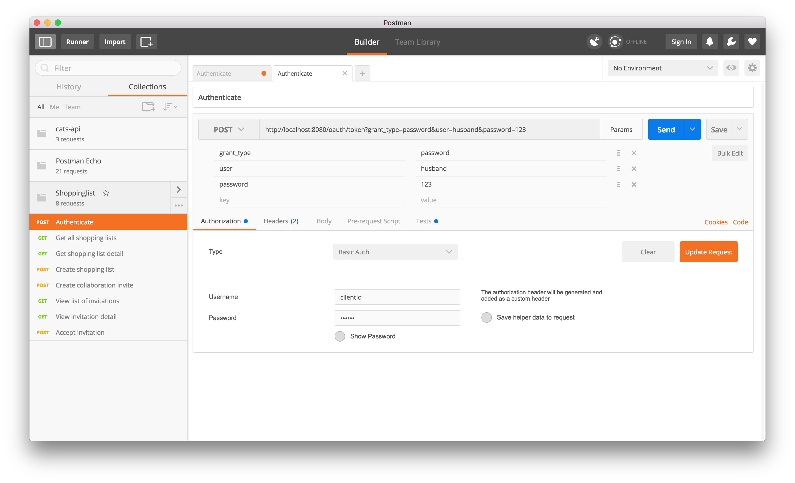
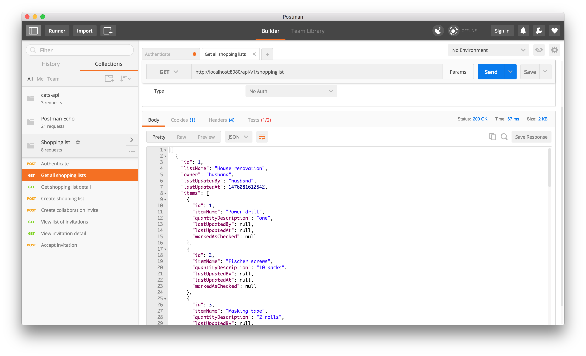
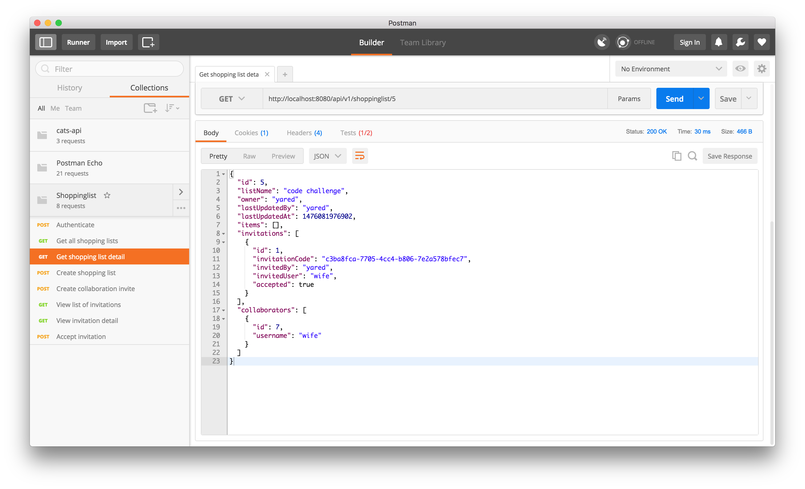
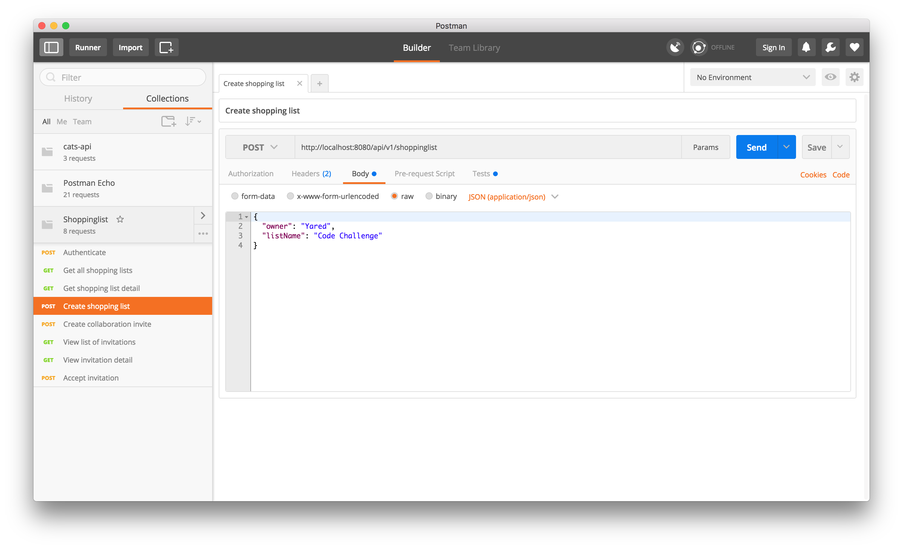
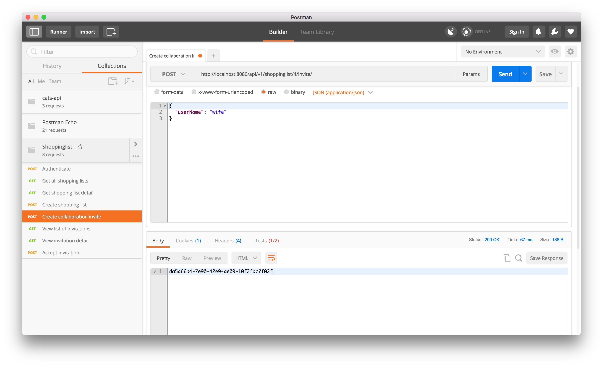
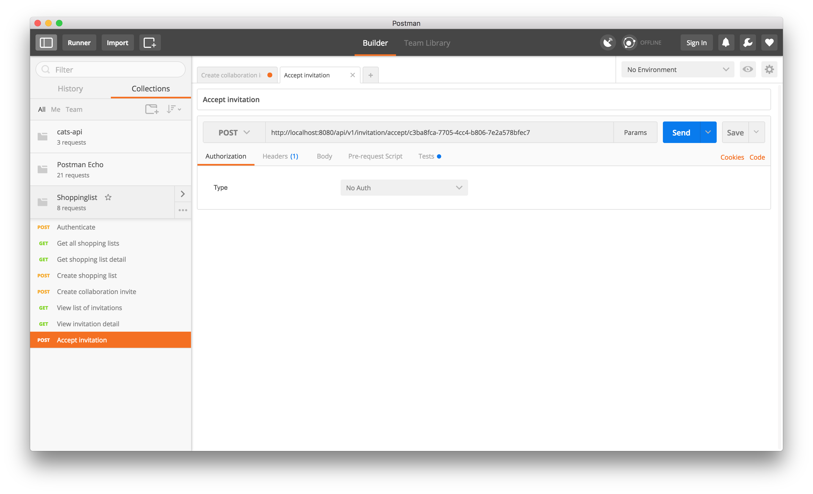

#ShoppingList API

##Introduction
A shopping list API application accessible from client applications (mobile apps and SPA web apps) and provides features for managing shopping list, shopping list items and allows users to invite other users to collaborate on a shopping list they own.

##Tools and technology
The application is a REST API built with SpringBoot, PostgresSQL and Gradle.

##Build and run
The application uses Gradle to build, test and run the API.

To build the application:

`$ gradle build`

To run the application:

`$ gradle bootRun`

The application will run and become available on port 8080 i.e http://localhost:8080.

## Available endpoints
The API exposes endpoints to manage shopping lists, create and manage collaboration invitations. Endpoint capabilities exposed by this API are documented using Swagger API documentations and to see list of avaialble operations navigate to http://localhost:8080/swagger-ui.html.

### Authentication

###Shopping list
List of shoppinglist

Shoppinglist detail 

Create new shoppinglist

###Collaboration invitation
Create invitation

Accept invitation

